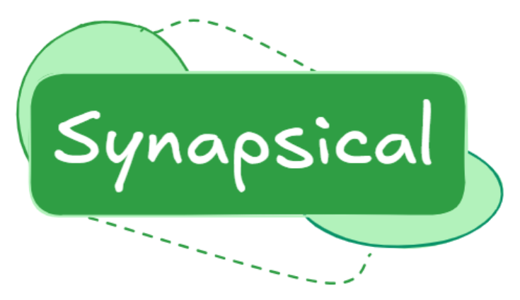

# Synapsical - Azure Synapse SqlPool .NET Client Library


[Synapsical is a .NET Client Library](https://www.nuget.org/packages/Synapsical.SynapseSqlPoolClient) that enables .NET developers to connect to Azure Synapse Analytics SQL Pools and perform CRUD operations on tables and data. The library supports multiple authentication modes, including Azure AD (with or without MFA), SQL authentication, and service principals. It provides an async-first, thread-safe API for scalable applications.

## Features
- **Connect to Synapse SQL Pools** using Azure AD (all modes), SQL authentication, or service principal.
- **Perform CRUD operations** on tables and data.
- **Async-first API** for scalable applications.
- **Thread-safe** client design.
- **Extensible** via connection factory abstraction for custom authentication or connection logic.

## Getting Started
**Prerequisites**
- .NET 6.0 or later
- Azure Synapse Analytics workspace with a dedicated SQL Pool
- Appropriate credentials for your chosen authentication mode

**Installation**
Install via NuGet:
```shell
dotnet add package Synapsical.SynapseSqlPoolClient
```

## Usage
### Instantiating the Client with Different Authentication Modes
```csharp
using Synapsical.Synapse.SqlPool.Client;
using Azure.Identity;
using Azure.Core;

// SQL Authentication
var sqlClient = new SynapseSqlPoolClient(
    sqlPoolEndpoint: "<server>.database.windows.net",
    database: "<db>",
    authMode: SqlAuthMode.SqlPassword,
    username: "<user>",
    password: "<password>"
);

// Azure AD Password
var aadPasswordClient = new SynapseSqlPoolClient(
    sqlPoolEndpoint: "<server>.database.windows.net",
    database: "<db>",
    authMode: SqlAuthMode.ActiveDirectoryPassword,
    username: "<aaduser@domain.com>",
    password: "<aadpassword>"
);

// Azure AD Integrated
var aadIntegratedClient = new SynapseSqlPoolClient(
    sqlPoolEndpoint: "<server>.database.windows.net",
    database: "<db>",
    authMode: SqlAuthMode.ActiveDirectoryIntegrated
);

// Azure AD Interactive (MFA)
var aadInteractiveClient = new SynapseSqlPoolClient(
    sqlPoolEndpoint: "<server>.database.windows.net",
    database: "<db>",
    authMode: SqlAuthMode.ActiveDirectoryInteractive,
    username: "<aaduser@domain.com>"
);

// Azure AD Service Principal
var spClient = new SynapseSqlPoolClient(
    sqlPoolEndpoint: "<server>.database.windows.net",
    database: "<db>",
    authMode: SqlAuthMode.ActiveDirectoryServicePrincipal,
    clientId: "<client-id>",
    password: "<client-secret>",
    tenantId: "<tenant-id>"
);

// Azure AD TokenCredential (e.g., DefaultAzureCredential)
TokenCredential credential = new DefaultAzureCredential();
var tokenClient = new SynapseSqlPoolClient(
    sqlPoolEndpoint: "<server>.database.windows.net",
    database: "<db>",
    authMode: SqlAuthMode.AccessToken,
    credential: credential
);
```

### CRUD Operations
```csharp
// Create a table
await sqlClient.CreateTableAsync("Employees", "(Id INT PRIMARY KEY, Name NVARCHAR(100), Age INT)");

// Insert a row
await sqlClient.InsertRowAsync("Employees", new Dictionary<string, object>
{
    ["Id"] = 1,
    ["Name"] = "Alice",
    ["Age"] = 30
});

// Query rows
var employees = await sqlClient.QueryAsync("SELECT * FROM Employees WHERE Age > 25");

// Update rows
await sqlClient.UpdateRowsAsync("Employees", "Id = 1", new Dictionary<string, object>
{
    ["Age"] = 31
});

// Delete rows
await sqlClient.DeleteRowsAsync("Employees", "Id = 1");

// Drop table
await sqlClient.DropTableAsync("Employees");
```

## Usage with Entity Framework Core
You can use SynapseSqlPoolClient to provide a connection for EF Core. Use the provided extension method:

```csharp
using Microsoft.EntityFrameworkCore;
using Synapsical.Synapse.SqlPool.Client;

var client = new SynapseSqlPoolClient(
    sqlPoolEndpoint: "<server>.database.windows.net",
    database: "<db>",
    authMode: SqlAuthMode.SqlPassword,
    username: "<user>",
    password: "<password>"
);

var optionsBuilder = new DbContextOptionsBuilder<MyDbContext>();
await optionsBuilder.UseSynapseSqlPoolClientAsync(client);

using var context = new MyDbContext(optionsBuilder.Options);
// Now use your context as usual
```

### Advanced EF Core Usage

**Context Pooling:**
```csharp
using Microsoft.Extensions.DependencyInjection;
using Microsoft.EntityFrameworkCore;
using Synapsical.Synapse.SqlPool.Client;

var client = new SynapseSqlPoolClient(...);
var conn = await client.GetOpenConnectionAsync();
services.AddDbContextPool<MyDbContext>(options =>
{
    options.UseSqlServer(conn);
});
```

**DbContext Factory:**
```csharp
services.AddDbContextFactory<MyDbContext>((provider, options) =>
{
    var conn = client.GetOpenConnectionAsync().GetAwaiter().GetResult();
    options.UseSqlServer(conn);
});
```

**Async Context Creation:**
```csharp
var optionsBuilder = new DbContextOptionsBuilder<MyDbContext>();
await optionsBuilder.UseSynapseSqlPoolClientAsync(client);
using var context = new MyDbContext(optionsBuilder.Options);
```


## Extensibility: Custom Connection Factories
You can inject your own `IDbConnectionFactory` for advanced scenarios (e.g., custom logging, connection pooling, or testability):
```csharp
var customFactory = new MyCustomSqlConnectionFactory(...);
var client = new SynapseSqlPoolClient("<server>", customFactory);
```

## API Reference
| Method | Description |
|-|-|
| `CreateTableAsync(string tableName, string schemaDefinition)` | Creates a new table. |
| `DropTableAsync(string tableName)` | Drops an existing table. |
| `TableExistsAsync(string tableName)` | Checks if a table exists. |
| `ListTablesAsync()` | Lists all tables. |
| `InsertRowAsync(string tableName, IDictionary<string, object> rowData)` | Inserts a row. |
| `QueryAsync(string sqlQuery)` | Executes a SELECT query. |
| `UpdateRowsAsync(string tableName, string whereClause, IDictionary<string, object> updatedValues)` | Updates rows. |
| `DeleteRowsAsync(string tableName, string whereClause)` | Deletes rows. |

## Error Handling
- All methods throw specific exceptions for connection, authentication, and SQL errors (see `SynapseSqlPoolException`).
- Errors are logged and can be traced for diagnostics.

## Thread Safety
- The client is thread-safe for concurrent operations.
- Each operation manages its own connection lifecycle.

## Limitations
- Some T-SQL features and data types may not be supported by Synapse SQL Pools.
- EF Core integration is not provided out-of-the-box, but you can use the connection string with EF Core if needed.

## Best Practices
- Use async methods for scalability.
- Use Azure AD authentication for production workloads.
- Handle exceptions and log errors for diagnostics.